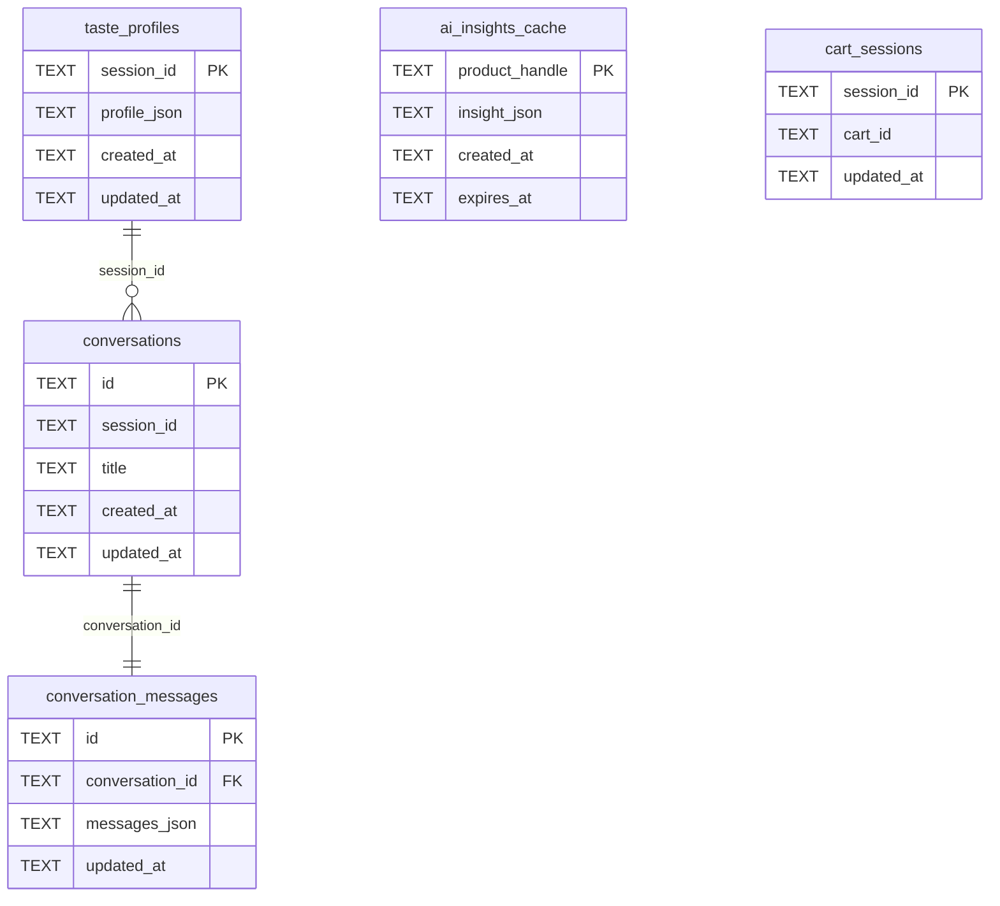

# feat: ShopAI Multi-Screen UI Redesign

## Overview

Transform the current single-page chat app into a polished multi-screen AI shopping concierge with three core screens: Dashboard, Conversational Concierge, and Product Detail. Adopt the ShopAI brand with Material Icons, dark-mode-first design, and persistent sidebar navigation. All data comes from live Shopify Storefront MCP — no mock data.

## Problem Statement

The current euporia app is a single full-screen chat. While the AI + Shopify integration works, the UI doesn't showcase the product vision. Users can't browse products visually, view detailed product pages, or manage their cart outside of conversation. There is no navigation, no conversation history, and no product-level AI insights.

## Proposed Solution

Build three screens behind a persistent sidebar, backed by the existing Shopify MCP and Rust/SQLite backend:

1. **Dashboard (`/`)** — Product grid from Shopify catalog, cart summary panel, recent chat sessions
2. **Chat (`/chat`)** — Upgraded chat with conversation sidebar, rich interactive product cards, suggestion chips
3. **Product Detail (`/products/[handle]`)** — Split-view with image gallery, AI review synthesis (cached), add to cart

## Technical Approach

### Architecture

```
app/
  layout.tsx                    # Root: fonts, dark mode class, metadata
  (main)/
    layout.tsx                  # Sidebar nav + cart context provider
    page.tsx                    # Dashboard
    chat/
      page.tsx                  # Chat concierge
    products/
      [handle]/
        page.tsx                # Product detail (Server Component)
  api/
    chat/
      route.ts                  # Existing AI chat endpoint (enhanced)
    products/
      [handle]/
        route.ts                # Proxy: get_product_details via MCP
        analysis/
          route.ts              # AI review synthesis (generate + cache)
    cart/
      route.ts                  # Cart mutations (add/get) via MCP
    conversations/
      route.ts                  # List/create conversations
      [id]/
        route.ts                # Get/update conversation messages
components/
  sidebar.tsx                   # Persistent sidebar nav
  product-card.tsx              # Upgraded: clickable, richer layout
  product-grid.tsx              # Responsive product grid
  cart-panel.tsx                # Sidebar cart summary (dashboard)
  cart-summary.tsx              # Existing (enhanced for cross-screen)
  chat.tsx                      # Existing (enhanced with history sidebar)
  chat-history-sidebar.tsx      # Conversation list panel
  suggestion-chips.tsx          # Quick-action chips for chat
  product-detail/
    image-gallery.tsx           # Main image + thumbnails
    ai-review-synthesis.tsx     # Pros/cons/sentiment display
    variant-selector.tsx        # Size/color/etc picker
    add-to-cart-button.tsx      # Quantity + add action
  ui/                           # shadcn components (existing + new)
lib/
  shopify-mcp.ts                # Existing MCP client
  shopify.ts                    # NEW: typed wrapper functions for MCP calls
  cart-context.tsx              # React context for cross-screen cart state
  utils.ts                      # Existing cn() helper
```

**Key architectural decisions:**

- **Route group `(main)/`** wraps all pages with the sidebar layout
- **Cart state** via React context at the `(main)/layout.tsx` level, backed by localStorage for the Shopify cart ID and refreshed via MCP on mount
- **Shopify data fetching** via a shared `lib/shopify.ts` module with typed functions (`searchProducts`, `getProductDetails`, `addToCart`, `getCart`). Server Components call these directly; client components call API routes
- **Chat history** saved to backend SQLite after each AI response completes
- **AI review synthesis** generated via a dedicated API route, cached in backend SQLite with 24-hour TTL
- **Dark mode** activated by adding `className="dark"` to `<html>` in root layout

### Database Schema Changes

**Migration `002_create_conversations.sql`:**

```sql
CREATE TABLE IF NOT EXISTS conversations (
  id TEXT PRIMARY KEY,
  session_id TEXT NOT NULL,
  title TEXT NOT NULL DEFAULT 'New Chat',
  created_at TEXT NOT NULL DEFAULT (datetime('now')),
  updated_at TEXT NOT NULL DEFAULT (datetime('now'))
);

CREATE INDEX idx_conversations_session ON conversations(session_id);
```

**Migration `003_create_conversation_messages.sql`:**

```sql
CREATE TABLE IF NOT EXISTS conversation_messages (
  id TEXT PRIMARY KEY,
  conversation_id TEXT NOT NULL REFERENCES conversations(id) ON DELETE CASCADE,
  messages_json TEXT NOT NULL,
  updated_at TEXT NOT NULL DEFAULT (datetime('now'))
);

CREATE UNIQUE INDEX idx_messages_conversation ON conversation_messages(conversation_id);
```

> Store the full message array as a JSON blob per conversation (not individual messages). This matches the Vercel AI SDK message format and simplifies save/load. One row per conversation.

**Migration `004_create_ai_insights_cache.sql`:**

```sql
CREATE TABLE IF NOT EXISTS ai_insights_cache (
  product_handle TEXT PRIMARY KEY,
  insight_json TEXT NOT NULL,
  created_at TEXT NOT NULL DEFAULT (datetime('now')),
  expires_at TEXT NOT NULL
);
```

**Migration `005_create_cart_sessions.sql`:**

```sql
CREATE TABLE IF NOT EXISTS cart_sessions (
  session_id TEXT PRIMARY KEY,
  cart_id TEXT NOT NULL,
  updated_at TEXT NOT NULL DEFAULT (datetime('now'))
);
```



### Backend API Additions

| Route | Method | Purpose |
|-------|--------|---------|
| `GET /api/conversations/{session_id}` | GET | List conversations (id, title, updated_at) |
| `POST /api/conversations/{session_id}` | POST | Create new conversation, return id |
| `GET /api/conversations/{session_id}/{conv_id}` | GET | Get conversation messages JSON |
| `PUT /api/conversations/{session_id}/{conv_id}` | PUT | Update messages JSON + title |
| `DELETE /api/conversations/{session_id}/{conv_id}` | DELETE | Delete conversation |
| `GET /api/insights/{product_handle}` | GET | Get cached AI insight or 404 |
| `POST /api/insights/{product_handle}` | POST | Store AI insight with TTL |
| `GET /api/cart-session/{session_id}` | GET | Get stored Shopify cart ID |
| `POST /api/cart-session/{session_id}` | POST | Store/update Shopify cart ID |

### Implementation Phases

#### Phase 1: Foundation (Routing, Theming, Sidebar)

Set up the multi-page skeleton and design system before building screen content.

**Tasks:**

- [ ] Add `className="dark"` to `<html>` in `frontend/app/layout.tsx`
- [ ] Replace Geist fonts with Inter in `frontend/app/layout.tsx`
- [ ] Update `frontend/app/globals.css`: change primary color to `#137fec`, update color palette to match mockup (background-dark: `#101922`, surface-dark: `#16202a`)
- [ ] Install Material Icons (add Google Fonts link to layout or install `@material-design-icons/font`)
- [ ] Create route group `frontend/app/(main)/layout.tsx` with sidebar component
- [ ] Build `frontend/components/sidebar.tsx`: ShopAI logo, nav links (Dashboard, Chat, Settings), active state, responsive collapse
- [ ] Move current page to `frontend/app/(main)/chat/page.tsx`
- [ ] Create placeholder `frontend/app/(main)/page.tsx` (dashboard)
- [ ] Create placeholder `frontend/app/(main)/products/[handle]/page.tsx`
- [ ] Update metadata title to "ShopAI" in root layout
- [ ] Install additional shadcn components: `npx shadcn@latest add badge skeleton separator tabs sheet tooltip select textarea`

**Success criteria:** Three routes render with a shared sidebar. Dark mode active. ShopAI branding visible.

#### Phase 2: Shared Infrastructure (Cart Context, Shopify Wrappers, Backend Schema)

Build the cross-cutting concerns that all three screens depend on.

**Tasks:**

- [ ] Create `frontend/lib/shopify.ts` with typed wrapper functions:

```typescript
// frontend/lib/shopify.ts
export async function searchProducts(query: string, context?: string): Promise<Product[]>
export async function getProductDetails(handle: string): Promise<ProductDetail>
export async function addToCart(cartId: string | null, merchandiseId: string, quantity: number): Promise<Cart>
export async function getCart(cartId: string): Promise<Cart>
```

- [ ] Create `frontend/lib/cart-context.tsx`: React context providing `{ cart, cartId, addItem, refreshCart, isLoading }`
  - On mount: check localStorage for `shopai-cart-id`, if exists call `getCart` via API route
  - `addItem` calls `POST /api/cart` and updates context state
  - Cart ID persisted in localStorage and backend
- [ ] Create `frontend/app/api/cart/route.ts`: POST (add to cart), GET (get cart) — wraps `callMCP`
- [ ] Wrap `(main)/layout.tsx` children in `<CartProvider>`
- [ ] Write backend migrations: `002_create_conversations.sql`, `003_create_conversation_messages.sql`, `004_create_ai_insights_cache.sql`, `005_create_cart_sessions.sql`
- [ ] Add backend conversation CRUD endpoints to `backend/src/main.rs`
- [ ] Add backend AI insights cache endpoints to `backend/src/main.rs`
- [ ] Add backend cart-session endpoints to `backend/src/main.rs`

**Success criteria:** Cart context works across pages. Backend accepts conversation and insight CRUD. Shopify wrapper functions callable from server and client.

#### Phase 3: Dashboard (`/`)

Build the landing page with product browsing, cart panel, and recent chats.

**Tasks:**

- [ ] Build `frontend/app/(main)/page.tsx` as Server Component:
  - Fetch featured products via `searchProducts("")` (returns catalog)
  - Pass products to client components
- [ ] Build `frontend/components/product-grid.tsx`: responsive grid (`grid-cols-1 sm:grid-cols-2 lg:grid-cols-3 xl:grid-cols-4`)
- [ ] Upgrade `frontend/components/product-card.tsx`:
  - Wrap in `next/link` to `/products/[handle]`
  - Match mockup styling: hover elevation, image zoom on hover, price badge
  - Add "Sale" or "New" badges when applicable
- [ ] Build `frontend/components/cart-panel.tsx` (right sidebar on dashboard):
  - Uses `useCart()` context
  - Shows line items, quantities, total
  - Checkout button linking to Shopify checkout URL
  - Empty state: "Your cart is empty — start browsing!"
- [ ] Add search bar to dashboard header (calls `searchProducts` and re-renders grid)
- [ ] Add "Recent Chats" section: fetch last 3-5 conversations from backend, show title + timestamp, link to `/chat?conversation={id}`
- [ ] Add loading skeletons for product grid and cart panel

**Success criteria:** Dashboard shows live Shopify products in a grid, cart panel reflects real cart state, recent chats link to conversation history.

#### Phase 4: Chat Concierge (`/chat`)

Upgrade the existing chat with conversation history sidebar and richer UI.

**Tasks:**

- [ ] Build `frontend/components/chat-history-sidebar.tsx`:
  - Fetch conversations from `GET /api/conversations/{sessionId}`
  - "New Chat" button at top
  - Conversation list grouped by date (Today, Yesterday, Last Week)
  - Active conversation highlighted
  - Click loads conversation messages into chat
- [ ] Update `frontend/components/chat.tsx`:
  - Accept optional `conversationId` prop
  - On mount: if `conversationId`, load messages from backend and hydrate `useChat`
  - After each AI response: save full message array to backend via `PUT /api/conversations/{sessionId}/{conversationId}`
  - Auto-generate conversation title from first user message (first 50 chars)
  - Add AI status indicator in header (green dot + "ShopAI Active" text)
- [ ] Update `frontend/app/api/chat/route.ts`:
  - Accept `conversationId` query param alongside `sessionId`
  - Update system prompt to reference ShopAI brand
- [ ] Build `frontend/components/suggestion-chips.tsx`:
  - Renders after AI responses as horizontal scrollable chip row
  - Static chips: "Show me new arrivals", "What's trending?", "View my cart", "Find something under $50"
  - Clicking a chip sends it as a user message
- [ ] Make product cards in chat clickable (wrap in `next/link` to `/products/[handle]`)
- [ ] Update chat layout to include history sidebar on left, chat stream on right
- [ ] Style chat bubbles to match mockup: user messages blue with rounded corners, AI messages in card-like containers

**Success criteria:** Chat has conversation sidebar, messages persist across sessions, suggestion chips work, product cards navigate to detail pages.

#### Phase 5: Product Detail (`/products/[handle]`)

Build the split-view product page with AI review synthesis.

**Tasks:**

- [ ] Build `frontend/app/(main)/products/[handle]/page.tsx` as Server Component:
  - Fetch product via `getProductDetails(handle)` using `callMCP` server-side
  - Pass product data to client sub-components
  - 404 page if product not found
- [ ] Build `frontend/components/product-detail/image-gallery.tsx`:
  - Main image (large, aspect-square) + thumbnail row below
  - Click thumbnail to change main image
  - Hover zoom effect on main image
- [ ] Build `frontend/components/product-detail/variant-selector.tsx`:
  - Render variant options from Shopify product data (size, color, etc.)
  - Highlight selected variant, gray out unavailable
  - Update displayed price when variant changes
- [ ] Build `frontend/components/product-detail/add-to-cart-button.tsx`:
  - Quantity selector (- / count / +)
  - "Add to Cart" button calling `useCart().addItem()`
  - Loading state while adding
  - Success feedback (button text changes to "Added!" briefly)
- [ ] Build `frontend/components/product-detail/ai-review-synthesis.tsx`:
  - On mount: fetch `GET /api/products/[handle]/analysis`
  - If cached: render immediately
  - If not cached: show skeleton, call `POST /api/products/[handle]/analysis` to generate
  - Display: sparkle icon + "AI Review Synthesis" header, pros list (green bullets), cons list (red bullets), "Who this is for" paragraph
- [ ] Create `frontend/app/api/products/[handle]/analysis/route.ts`:
  - GET: check backend cache (`GET /api/insights/{handle}`), return if valid
  - POST: fetch product details from Shopify MCP, call Claude to generate synthesis, save to backend cache with 24h TTL, return result
  - Claude prompt: "Analyze this product and generate: 3 pros, 2 cons, a 'who this is for' paragraph, and feature ratings (1-10) for relevant attributes"
- [ ] Build feature sentiment bars (horizontal colored bars showing ratings like Sound Quality 9.2/10)
- [ ] Add breadcrumb navigation at top of product detail
- [ ] Handle product not found (Shopify returns empty/error)

**Success criteria:** Product detail page shows live Shopify product with images, variants, add-to-cart, and AI-generated review synthesis.

#### Phase 6: Polish and Integration

Final touches, cross-screen consistency, and edge case handling.

**Tasks:**

- [ ] Add cart item count badge to sidebar navigation
- [ ] Add loading skeletons to all data-fetching screens
- [ ] Handle Shopify MCP errors gracefully on all screens (error boundaries, retry buttons)
- [ ] Handle empty states: no products found, empty cart, no chat history, no AI synthesis available
- [ ] Ensure product cards in chat use the same upgraded component as the dashboard
- [ ] Add `next/image` error fallback (placeholder image) for broken Shopify CDN URLs
- [ ] Mobile responsiveness: sidebar collapses to bottom tab bar on `< md` screens
- [ ] Test cross-screen cart flow: add from detail page, verify in dashboard panel, verify in chat
- [ ] Update page metadata (titles, descriptions) for each route
- [ ] Remove old root `page.tsx` (replaced by `(main)/page.tsx` dashboard)

**Success criteria:** All three screens work together. Cart is consistent. Errors are handled. Mobile is usable.

## Acceptance Criteria

### Functional Requirements

- [ ] Three distinct screens accessible via sidebar navigation: Dashboard, Chat, Product Detail
- [ ] Dashboard shows live Shopify products in a browsable grid
- [ ] Dashboard shows cart summary panel with real cart state
- [ ] Dashboard shows recent chat sessions linking to conversation history
- [ ] Chat supports multiple conversations with sidebar history
- [ ] Chat messages persist in backend SQLite across browser sessions
- [ ] Chat displays rich, clickable product cards that navigate to product detail
- [ ] Chat shows suggestion chips after AI responses
- [ ] Product detail page shows Shopify product with image gallery and variant selector
- [ ] Product detail page generates and caches AI review synthesis
- [ ] Add to cart works from both chat (AI tool) and product detail (button)
- [ ] Cart state is shared across all screens via React context
- [ ] Cart ID persists in localStorage for session recovery

### Non-Functional Requirements

- [ ] Dark mode is the default theme
- [ ] ShopAI branding with Material Icons and #137fec primary color
- [ ] All data comes from live Shopify Storefront MCP — no mock data
- [ ] Pages load with skeleton states (no blank screens)
- [ ] Product images have fallback on error
- [ ] Mobile responsive: sidebar becomes bottom nav on small screens

### Quality Gates

- [ ] All existing `make check` passes (clippy + eslint)
- [ ] No TypeScript errors (`tsc --noEmit`)
- [ ] Cross-screen cart flow tested manually end-to-end
- [ ] AI review synthesis generates and caches correctly

## Dependencies & Prerequisites

- Shopify Storefront MCP at `store.bitcoinmagazine.com` must be accessible
- `ANTHROPIC_API_KEY` env var set for AI review synthesis generation
- Backend running on port 3010, frontend on port 3011
- Node.js and Rust toolchain installed

## Risk Analysis & Mitigation

| Risk | Impact | Mitigation |
|------|--------|------------|
| Shopify MCP rate limits | Products don't load | Cache catalog results, add retry with backoff |
| Claude API costs from review synthesis | Expensive per product | Backend cache with 24h TTL, generate only on user visit |
| Chat history messages too large for SQLite | Slow queries | Limit to 100 messages per conversation, paginate |
| Cart ID lost (localStorage cleared) | User loses cart | Also persist cart ID in backend `cart_sessions` table |
| Shopify product removed after AI references it | Broken links in chat | Product cards handle 404 gracefully with "no longer available" state |

## References & Research

### Internal References
- Brainstorm: `docs/brainstorms/2026-02-12-shopai-ui-redesign-brainstorm.md`
- Existing chat: `frontend/components/chat.tsx`
- Existing product card: `frontend/components/product-card.tsx`
- Existing cart summary: `frontend/components/cart-summary.tsx`
- Chat API route: `frontend/app/api/chat/route.ts`
- Shopify MCP client: `frontend/lib/shopify-mcp.ts`
- Backend main: `backend/src/main.rs`
- Current migration: `backend/migrations/001_create_profiles.sql`
- shadcn config: `frontend/components.json`
- Theme CSS: `frontend/app/globals.css`
